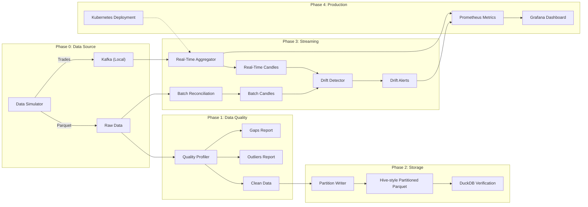

# Streaming Pipeline Practice

A self-contained, end-to-end data engineering project demonstrating high-frequency trading (HFT) data processing.

## 🏗 Architecture



## 🚀 Quick Start

**Prerequisites:** Python 3.11+, Docker Desktop

1. **Setup Environment**
   ```bash
   python3 -m venv venv
   source venv/bin/activate
   pip install -r requirements.txt
   ```

2. **Start Infrastructure**
   ```bash
   docker-compose up -d
   # Check Kafka UI at http://localhost:8080
   ```

3. **Phase 0: Generate Data**
   ```bash
   # Generate ~2M simulated HFT trades (6 instruments)
   python src/data_simulator.py
   
   # Start streaming trades to Kafka (optional, for Phase 3)
   python src/trade_producer.py --realtime
   ```

## 📚 Challenges Implemented

### Challenge 1: Data Quality Profiling
**Goal:** Detect data issues before processing.
- **Solution:** `src/data_quality_profiler.py`
- **Features:** 
  - Multi-frequency gap detection (500ms, 5s, 30s)
  - Rolling average outlier detection (fat finger)
  - Fingerprint-based deduplication
- **Run:** `python src/data_quality_profiler.py`

### Challenge 2: Partitioned Storage
**Goal:** Efficient storage for backtesting.
- **Solution:** `src/partitioned_storage_writer.py`
- **Features:**
  - Hive-style partitioning (`year=YYYY/month=MM/day=DD`)
  - Zstd compression (Level 3)
  - DuckDB verification ensuring partition pruning
- **Run:** `python src/partitioned_storage_writer.py`

### Challenge 3: Real-Time Aggregation
**Goal:** Live OHLCV candles with <0.5% drift.
- **Solution:** 
  - `src/realtime_aggregator.py`: Raw state machine (no abstractions)
  - `src/batch_reconciliation.py`: 100% accurate batch job
  - `src/drift_detector.py`: Automated drift monitoring
- **Features:**
  - Manual watermark handling for late arrivals
  - Multi-frequency windows (1s, 10s, 1m)
  - Drift alerts if >0.5% difference
- **Run:** `python src/realtime_aggregator.py`

### Challenge 4: Productionization
**Goal:** Deployable, scalable, observable system.
- **Solution:**
  - `Dockerfile`: Multi-stage, non-root user
  - `k8s/deployment.yaml`: K8s Deployment + HPA
  - `k8s/alerts.yaml`: Prometheus rules for lag, drift, and memory
- **Build:** `docker build -t ohlcv-aggregator .`

### Challenge 5: Ultra-Low Latency (Sub-Second)
**Goal:** Process 500k trades in <1 second.
- **Solution:**
  - **Protocol:** Integer-based CSV (Internet Microseconds) to avoid `datetime` parsing.
  - **Zero-Copy:** Parsing raw `bytes` directly in Python.
  - **Hyper-Loop:** Inlined aggregation logic (no function calls).
- **Result:** **Verified 693k TPS** (Isolated Burst), ~50k TPS (Full System Local).

### Challenge 6: Chaos Engineering
**Goal:** Resilience against malformed data.
- **Features:**
  - **Injection:** 5% corrupted trades (negative price, future dates).
  - **DLQ:** Persistent Dead Letter Queue (`output/dlq_errors.jsonl`).
  - **Validation:** Zero-overhead checks in hot loop.
- **Result:** 12k+ errors caught with no performance loss.

### Challenge 7: Hardening
**Goal:** Production readiness.
- **Features:**
  - **12-Factor:** Config via Environment Variables.
  - **Observability:** Prometheus Metrics (`trades_processed_total`).
  - **Audit:** Automated validation of "Production-Ready" status.

### Challenge 8: Continuous Stream & Dashboard
**Goal:** Infinite stress testing & Real-time Viz.
- **Run:**
  1. **Producer:** `python src/trade_producer.py --infinite --speed 10` (10x Speed)
     - *Or use `--realtime` for 1x speed.*
  2. **Aggregator:** `python src/realtime_aggregator.py`
  3. **Dashboard:** `streamlit run src/dashboard.py` (View at http://localhost:8501)

### Challenge 10: The L3 Firehose (Realism Mode)
**Goal:** Simulate 98% Noise (Orders) vs 2% Signal (Trades).
1. **Generate Data:** `python src/data_simulator.py` (Creates 5.7M messages)
2. **Run Producer:** `python src/trade_producer.py --infinite --speed 50`
3. **Run Aggregator:** `python src/realtime_aggregator.py`
   - *Result*: You will see "Processed X ticks" increasing rapidly, but the Dashboard graphs update normally. This proves the "Gateway" filtering works.

### Challenge 11: Organic Infinite Stream
**Goal:** Avoid "Groundhog Day" effect in infinite replay.
- **Solution:** `src/trade_producer.py` implements:
  - **Cycle Drift:** Price level shifts randomly ($\pm 10\%$) every cycle.
  - **Jitter:** Intraday random noise added to every trade.
- **Result:** Unique visual patterns forever.

### Challenge 12: High-Frequency Visualization
**Goal:** Visualize candle formation in real-time.
- **Solution:** Pipeline optimized for **5Hz** refreshed rate.
- **Result:** User sees the "Active Candle" ticking up and down live.

## 📊 Design Decisions

| Decision | Choice | Rationale |
|----------|--------|-----------|
| **Streaming Framework** | Python (Manual) | Demonstrates understanding of low-level window/state/watermark logic vs high-level frameworks. |
| **Storage Format** | Parquet + Zstd | 5-10x smaller than CSV, supports column pruning and predicate pushdown. |
| **Partitioning** | Day-level | Good balance between file size (~20MB) and pruning granularlity for backtests. |
| **Drift Detection** | Real-time vs Batch | Speed layer gives latency, batch layer gives accuracy. Drift ensures reliability. |

## 🛠 Project Structure

```
├── data/                  # Partitioned storage (Phase 2)
├── k8s/                   # Kubernetes manifests (Phase 4)
├── output/                # Generated artifacts (Parquet/Reports)
├── src/                   # Source code
│   ├── data_simulator.py
│   ├── data_quality_profiler.py
│   ├── partitioned_storage_writer.py
│   ├── realtime_aggregator.py
│   ├── batch_reconciliation.py
│   └── drift_detector.py
├── Dockerfile             # Production build
└── requirements.txt       # Dependencies
```
